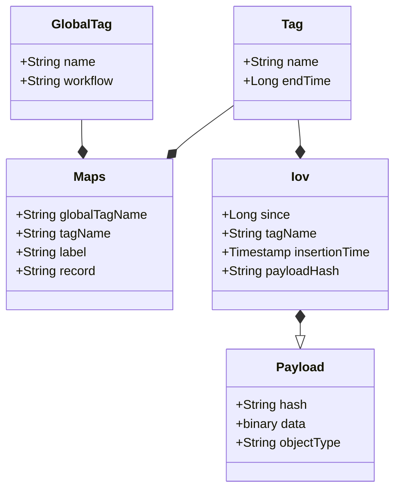
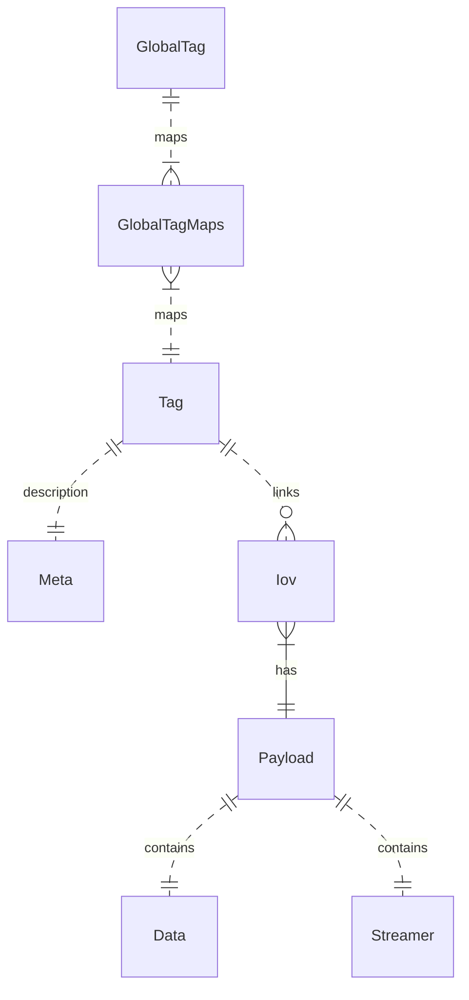

#### Author: A.Formica, R.Sipos
#### Contributors: M.Mineev, E.Alexandrov (client tools)
```
   Copyright (C) 2016  A.Formica, R.Sipos

    This program is free software: you can redistribute it and/or modify
    it under the terms of the GNU General Public License as published by
    the Free Software Foundation, either version 3 of the License, or
    (at your option) any later version.

    This program is distributed in the hope that it will be useful,
    but WITHOUT ANY WARRANTY; without even the implied warranty of
    MERCHANTABILITY or FITNESS FOR A PARTICULAR PURPOSE.  See the
    GNU General Public License for more details.

    You should have received a copy of the GNU General Public License
    along with this program.  If not, see <http://www.gnu.org/licenses/>.
```
# Table of Contents
1. [Description](#description)
1. [Workflows](#workflows)

## Description
CREST service is a RESTful API for the storage and retrieval of IOVs (Interval of Validity) and payloads.
The data model is illustrated in the following diagram:



The entity relationship in the relational DB is represented in the following diagram:



## Workflows
The typical operational workflows can 

